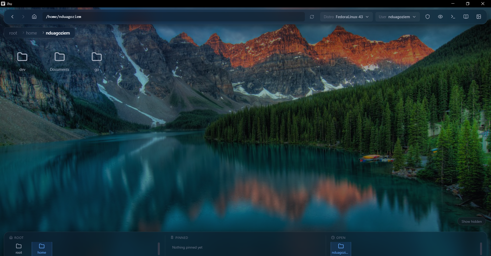
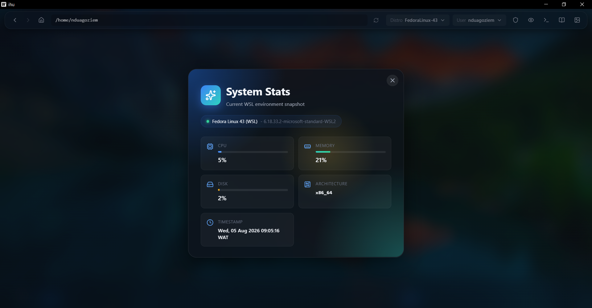

# ihu

[](LICENSE)

**A visual desktop for WSL2.**

WSL2 (Windows Subsystem for Linux) lets you run a real Linux environment inside Windows — but you
normally only reach it through a command line. **ihu brings that Linux world into a window:** browse
your files by clicking, watch system resources live, and drop into a real terminal when you need one.





- **For non-developers:** think of it as a "File Explorer + dashboard" for the Linux side of your PC.
  No commands required for everyday things like opening folders and files.
- **For developers:** it's a Wails (Go + Vue) app wrapping the `wsl.exe` interface, with a genuine
  ConPTY-backed terminal, multi-distro/multi-user awareness, and a clean place to add new tooling.

> **Runs on:** Windows 10/11 with WSL2 installed (it drives `wsl.exe`).
> **Developed on:** any OS — the Go and Vue code can be edited and cross-compiled from macOS or Linux;
> only *running* the finished app requires Windows + WSL2.

## What it does today

- 🗂️ **Visual file explorer** for the WSL2 filesystem — browse, sort, and pin favorite folders.
- 👀 **File viewer & editor** — preview images, PDFs, and Word docs; edit text files in place.
- 🖥️ **Integrated real terminal** — a true pseudo-terminal (ConPTY) for `curl`, `dnf`, `docker`, etc.,
  with working `Ctrl-C` and live progress output. (Heavy TUIs like `vim`/`htop` are intentionally out of scope.)
- 📊 **Live system stats** — CPU, memory, and disk usage of the running distro.
- 🧑‍🤝‍🧑 **Multi-distro & multi-user** — switch distros/users and run elevated (`sudo`) actions.
- 🎨 **Personalization** — custom backgrounds and a tidy, glassy UI.

## Getting started

**Prerequisites:** [Go](https://go.dev/), [Node.js](https://nodejs.org/), the
[Wails CLI](https://wails.io/docs/gettingstarted/installation), and (to run) Windows with WSL2.

```bash
# Live development with hot-reload frontend
wails dev

# Build a redistributable Windows package
wails build
```

Project settings live in `wails.json` — see the [Wails project config docs](https://wails.io/docs/reference/project-config).

## Project structure

The Go backend talks to WSL2; the Vue frontend renders it. **The `wsl/` folder is the core of the
application — every WSL2 capability lives here**, and each new feature gets its own subpackage.

```
ihu/
├── main.go                 # Windows entry point; embeds the built frontend
├── app.go                  # Wails app: exposes Go methods to the frontend
├── wails.json              # Wails project configuration
│
├── boot/                   # Long-lived background WSL2 shell (the engine behind the visuals)
│   ├── boot.go             #   starts/streams/closes the persistent session
│   └── windows_process.go  #   keeps helper terminal windows hidden
│
├── config/                 # Persisted app settings (default distro, pinned folders, background)
│
├── wsl/                    # ★ CORE — everything that interacts with WSL2
│   ├── wsl.go              #   filesystem ops: list dirs, read/write files, list users & distros
│   ├── system_stats.go     #   CPU / memory / disk metrics
│   └── terminal/           #   integrated PTY terminal
│       ├── terminal.go     #     session manager + streaming to the UI
│       └── conpty_windows.go #   low-level Windows ConPTY wrapper
│
├── frontend/               # Vue 3 + Vite UI
│   ├── src/
│   │   ├── App.vue         #   app shell & layout
│   │   ├── components/     #   UI pieces (file grid, terminal drawer, stats, viewers, …)
│   │   ├── composables/    #   shared reactive helpers (e.g. toasts)
│   │   └── data/           #   static UI data
│   └── wailsjs/            #   auto-generated JS bindings to the Go methods
│
└── build/                  # Wails build assets (icons, installer config)
```

**Convention:** each new backend feature becomes a package under `wsl/`. For example, the Docker
dashboard goes in `wsl/docker/`, and so on — then it's wired
into the UI through `app.go` and a Vue component.

## Roadmap

The mission is to make more of WSL2 *visual*. These are ordered by necessity, and **anyone is welcome
to pick one up.**

1. **Storage Cleaner** — a visual utility to reclaim space, since the WSL2 `.vhdx`
   disk image can grow very large over time.
2. **Port Forwarding & Network Monitor** — a dashboard of all ports listening inside
   WSL (e.g. `localhost:8080` for a React app, `localhost:5432` for Postgres) with one-click "open in
   Windows browser," since WSL↔Windows port mapping can get messy.
3. **Multi-Distro Tabbed / Split View** — a split-screen view (e.g. Ubuntu on the
   left, Alpine on the right) with drag-and-drop file transfer between distros.
4. **Live Docker Dashboard** — view running containers, images, and volumes inside a
   specific distro.
5. **One-click Services & Databases** — install and manage PostgreSQL, Redis, Nginx,
   and similar via clicks instead of commands.

## Contributing

Contributions are welcome — grab a roadmap item, follow the `wsl/<feature>/` convention, and open a PR.
Built with the [Wails](https://wails.io/) Vue template.

## License

Licensed under the [GNU GPL v3](LICENSE).
